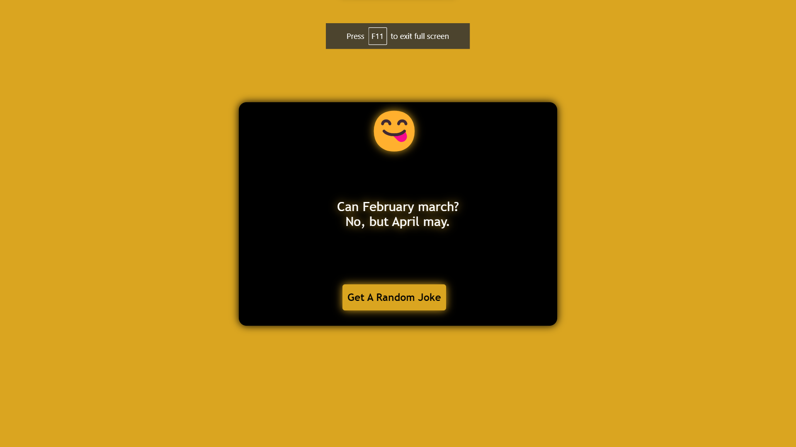
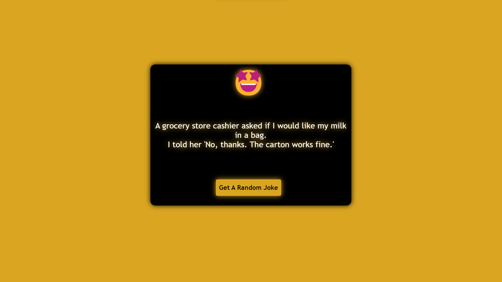
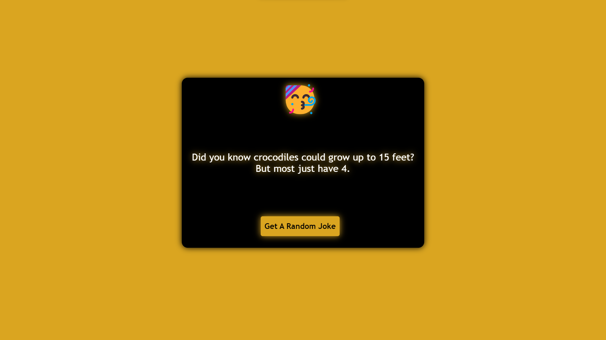

## Random Jokes Project

---

This is a simple random jokes app that displays a random joke everytime user clicks on Get A Random Joke button.

 
---

Welcome to today’s Challenge. Today we are going to create a random joke generator. For this, we are going to use HTML, CSS and Javascript. We use a Joke Json in this Challenge.

The joke generator project is build to increase the knowledge of the json and fetch the data from the json file.

### What is the purpose of this project?
The main goal for this project is to create a website that will provide users with random jokes in different categories.

 

### 🖥️ ScreenShot :

 

 

### 👩‍💻 Tech Stack :

 

- HTML
- CSS
- Js
- Json

 

# ©️ Copyright : 

    
2024 © Copyright  And Design By <a href="https://github.com/NikhilPathaniaa">Nikhil Pathania😃</a>
    

